# Vorcaro Enterprises Sovereign Finance Ledger

## Product Description and Technical Build Guideline

## 1. Product Vision

**Vorcaro Enterprises Sovereign Finance Ledger** is a local-first, encrypted, offline-capable finance operations platform for Vorcaro Enterprises C-level leadership.

Its purpose is to give Vorcaro Enterprises full control over financial operations, cash flow, approvals, reporting, auditability, and operational truth without dependency on external cloud platforms, public blockchains, third-party SaaS dashboards, or network availability.

The application must run as an **ElectronJS desktop application**, store encrypted data locally, operate with **zero external resources loaded at startup**, and synchronize with a Vorcaro-owned server that acts as the operational source of truth.

The product is not a simple finance dashboard. It is a **secure financial command system**.

---

## 2. Core Principles

### 2.1 Sovereignty First

Vorcaro Enterprises owns:

* The application code.
* The signing infrastructure.
* The server infrastructure.
* The encryption and recovery process.
* The certificate authority.
* The operational ledger.
* The backups.
* The audit trail.

No public blockchain in version one. No vendor-controlled source of truth. No cloud dependency required for core operation.

**Sovereignty question:** If every external vendor vanished tomorrow, could Vorcaro Enterprises still read, verify, recover, and operate its finance system?

**AI boundary:** AI may assist analysis and reconciliation, but it must never become the owner of truth, keys, or final approval.

---

### 2.2 Financial Truth Over Speed

The system optimizes for:

* Accuracy.
* Tamper evidence.
* Recoverability.
* Auditability.
* Deterministic synchronization.
* Executive accountability.

Speed is optional. Truth is not.

Offline operations are permitted, but they are treated as **signed intentions** until accepted by the Vorcaro server.

**Sovereignty question:** Are we letting offline executives create verified intent, or are we accidentally letting isolated laptops rewrite corporate reality?

**AI boundary:** AI agents may prepare proposed events, flag inconsistencies, and summarize risks. Humans approve material financial actions.

---

### 2.3 Local-First, Server-Authoritative

Each C-level device has a full encrypted local replica of the relevant financial data. The Vorcaro server is the operational source of truth.

When online, the client fetches current server state before submitting a new operation.

When offline, the client operates against the last verified snapshot and creates pending signed events.

Once the network returns, the server validates, orders, accepts, rejects, or marks events for conflict resolution.

---

## 3. Recommended Architecture

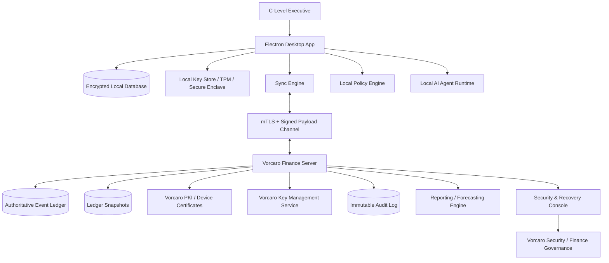

### Rationale

This architecture gives Vorcaro Enterprises:

* Offline executive operation.
* Local encrypted access.
* Centralized operational truth.
* Cryptographic proof of actions.
* Device revocation.
* Key recovery under Vorcaro control.
* No public blockchain dependency.
* No startup dependency on external resources.

Electron is acceptable only if treated as a hardened application shell. Electron’s official security guidance emphasizes measures such as context isolation, sandboxing, limiting navigation, validating IPC, and avoiding unsafe renderer exposure.

---

## 4. Major Components

## 4.1 Electron Desktop App

The Electron app is the executive interface and local operating environment.

### Responsibilities

* Display dashboards.
* Store encrypted local data.
* Allow offline review and pending operations.
* Sign every executive action.
* Maintain sync queue.
* Validate server responses.
* Run local AI assistance.
* Enforce local policy rules.
* Never load remote UI code at startup.

### Hardening Requirements

The app must use:

* No remote JavaScript.
* No CDN assets.
* No arbitrary webviews.
* No Node.js access in renderer processes.
* Context isolation enabled.
* Renderer sandboxing enabled.
* Strict Content Security Policy.
* IPC allowlist.
* Signed app builds.
* Signed updates from Vorcaro infrastructure only.
* No external telemetry by default.
* Local integrity verification at startup.

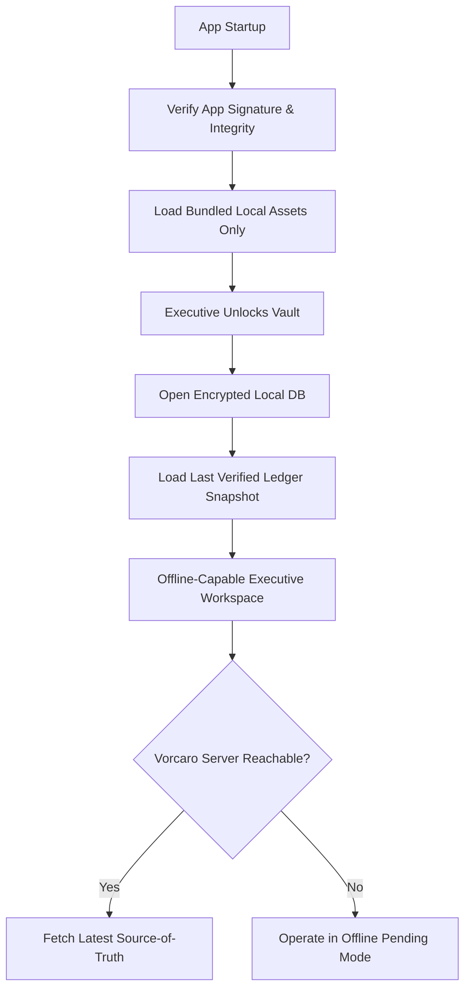

**Sovereignty question:** Can the application boot, display data, and operate without touching the public internet, DNS, analytics, or a vendor endpoint?

**AI boundary:** Local AI can summarize cash position, detect anomalies, and draft actions. It must not bypass signing, policy, or approval workflows.

---

## 4.2 Encrypted Local Database

Recommended options:

* SQLite with SQLCipher-style full database encryption, or
* An embedded encrypted database controlled by Vorcaro Tech.

The local database should contain:

* Ledger snapshots.
* Pending local events.
* Sync metadata.
* Executive-visible financial data.
* Local audit logs.
* Cached reports.
* AI-generated but clearly labeled analysis.

The local database is a **replica**, not the final source of truth.

### Local Storage Rule

All sensitive local data must be encrypted at rest. No plaintext finance data should exist in local app storage, logs, crash reports, exports, or cache files.

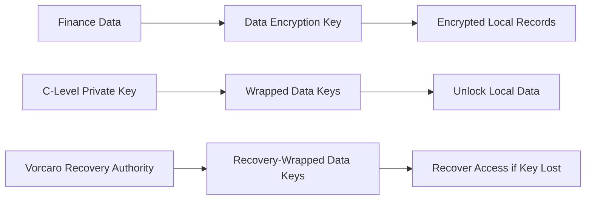

**Sovereignty question:** If a device is stolen, does the thief steal data—or only encrypted noise with expensive branding?

**AI boundary:** AI may read decrypted data only inside the authenticated local session and only according to the executive’s permissions.

---

## 4.3 Vorcaro Finance Server

The Vorcaro server is the operational source of truth.

### Responsibilities

* Maintain authoritative event ledger.
* Validate signatures.
* Validate device certificates.
* Enforce authorization.
* Assign global event order.
* Detect conflicts.
* Create ledger snapshots.
* Manage revocation.
* Support recovery ceremonies.
* Provide reporting APIs.
* Maintain immutable audit logs.

Recommended backend stack:

* SQLite (SQLCipher-encrypted) for authoritative relational state — embedded,
  single-file, sovereign storage matching the single-writer ledger discipline
  (schema detailed in `DATABASE_OVERVIEW.md`).
* Append-only event store for financial events.
* Object storage for encrypted attachments.
* HSM or equivalent hardened key protection for server signing keys.
* Internal Vorcaro certificate authority.
* Dedicated admin console for security, recovery, revocation, and audits.

### Payload Visibility Decision

There is a tension the design must resolve explicitly rather than by accident: event payloads are stored encrypted, yet the server is asked to enforce finance policy ("payment above threshold"), detect conflicts on financial objects, run reporting/forecasting, and run fraud-detection AI. All of those require reading financial content.

**Decision for version one: the server is a trusted decryptor, not a blind relay.** Payloads are encrypted in transit (mTLS) and at rest (server-side DEKs under HSM control), but the Vorcaro server can decrypt them to enforce policy, order events, detect conflicts, and produce reports. This is consistent with "server-authoritative" and with Vorcaro owning the server.

Two consequences must be stated honestly:

* This is **not** end-to-end encryption between executives. A fully compromised server can read finance data. The mitigations are the ones already in this plan: HSM-held keys, immutable audit, checkpoint anchoring (below), and Vorcaro owning the infrastructure.
* Every event also carries **plaintext-signed routing metadata** (`event_type`, `object_type`, `object_id`, `base_server_sequence`, amounts for threshold policy) so that certificate checks, replay protection, and coarse policy can run before decryption, and so the hash chain covers fields clients can verify without payload access.

If a future version demands true E2E encryption, the server loses policy enforcement, conflict semantics, reporting, and server-side AI — those would have to move client-side or into enclaves. That trade is out of scope for version one and should be a deliberate decision, never a drift.

### Server Trust Rule

The server is authoritative, but not magically trusted. Clients must verify server signatures, ledger hash chains, and snapshot integrity.

Signature verification alone does not prevent a compromised server from **forking or rolling back** the ledger — it holds the signing key, so it can sign a rewritten history. The answer to "can an executive independently prove the server modified nothing?" is **checkpoint anchoring**:

* The server periodically emits a signed checkpoint: `(sequence, ledger_hash, timestamp)`.
* Every enrolled device stores every checkpoint it has ever verified and refuses any future server state that is not a descendant of its stored checkpoints.
* Devices exchange latest checkpoints opportunistically through the server ("gossip"); because checkpoints are signed by the server itself, a rollback becomes self-incriminating evidence rather than a silent rewrite.
* Quarterly checkpoint hashes are additionally stored offline (printed, archived by Internal Audit) so history survives even total device loss.

A split view (two executives holding checkpoints from incompatible histories) is treated as a critical security incident, not a sync bug.

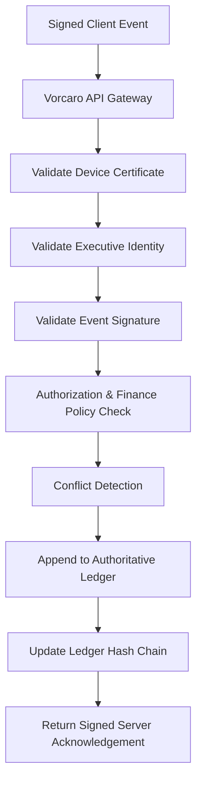

**Sovereignty question:** Can a Vorcaro executive independently prove the server accepted, rejected, or modified nothing without authorization?

**AI boundary:** Server-side AI can detect fraud patterns and reconciliation gaps. It should not directly append authoritative events.

---

## 5. Identity, Keys, and Recovery

## 5.1 Executive Key Model

Each C-level executive should experience the system as having **one private executive key**.

Implementation should use a key hierarchy:

```text
Executive Root Key
├── Signing Key
├── Encryption-Unwrapping Key
└── Device-Binding Key
```

This keeps the product simple for executives while keeping the cryptography survivable.

### Why Not Encrypt Everything Directly With One Private Key?

Because revocation, rotation, and recovery become painful. Instead, use **envelope encryption**:

```text
Financial data is encrypted with Data Encryption Keys.
Data Encryption Keys are wrapped for authorized executives.
Executive keys unlock the wrapped keys.
Vorcaro recovery can re-wrap keys after approved recovery.
```

NIST SP 800-57 provides general guidance and best practices for cryptographic key management, including lifecycle concerns around keying material.

---

## 5.2 Recovery Model

Vorcaro Enterprises controls recovery.

Recommended model:

* Recovery requires multiple authorized Vorcaro custodians.
* Use threshold approval, for example 2-of-3 or 3-of-5.
* Recovery events are logged immutably.
* Recovery creates a new executive key.
* Old lost key is revoked.
* Data keys are re-wrapped for the new key.
* All affected devices must resync before further privileged action.

### Revocation Must Not Rewrite History

Revoking a key ends its authority **from the revocation event forward**. Events signed before revocation remain valid — verification always checks the signature against the key version that was active at the event's `server_sequence` (which is why `key_packages` carries `key_version`). Without this rule, recovering one lost CFO key would retroactively invalidate years of legitimately signed ledger history, which is the opposite of auditability.

The only retroactive action allowed is **quarantine for review**: unconfirmed pending events from a compromised key/device are held for governance, never silently dropped and never auto-invalidated.

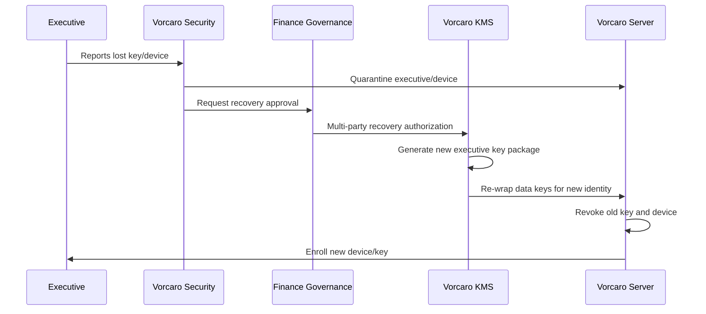

**Sovereignty question:** Can Vorcaro recover from one lost executive key without begging a vendor, and can Vorcaro survive total key loss only by accepting that data is gone?

**AI boundary:** AI can prepare recovery risk reports. Humans must authorize recovery.

---

## 5.3 Device Revocation

Every device must have:

* Device identity.
* Device certificate.
* Executive binding.
* Hardware-backed key when available.
* Revocation status.
* Last seen timestamp.
* Risk score.
* Local wipe/quarantine capability.

If a laptop is stolen:

1. Vorcaro marks the device revoked.
2. Server refuses future sync.
3. Other clients receive revocation list.
4. Executive key is rotated if needed.
5. Pending events from that device are quarantined.
6. Financial governance reviews unconfirmed actions.

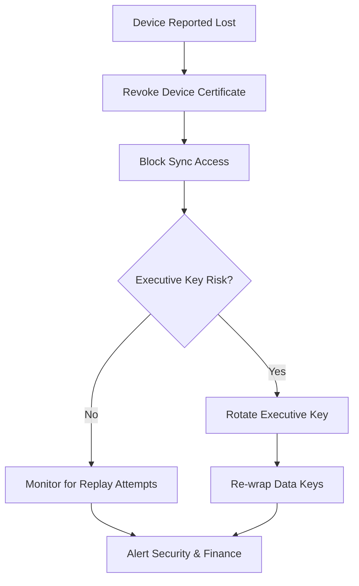

**Sovereignty question:** Is the stolen machine still a participant in the company, or just a very expensive paperweight?

**AI boundary:** AI can detect suspicious post-theft activity. Humans decide revocation and key rotation.

---

## 6. Ledger and Event Model

The application should be event-sourced.

Instead of mutating financial records directly, all changes become signed events.

### Example Event

```json
{
  "event_id": "evt_01J...",
  "event_type": "PAYMENT_APPROVAL_CREATED",
  "actor_id": "exec_cfo_001",
  "device_id": "dev_vorcaro_laptop_044",
  "client_timestamp": "2026-07-01T14:23:11Z",
  "base_server_sequence": 912388,
  "device_event_counter": 4471,
  "object_type": "payment_approval",
  "object_id": "pay_9921",
  "payload_hash": "sha256:...",
  "encrypted_payload": "...",
  "signature": "...",
  "status": "pending"
}
```

### What the Client Signs vs. What the Server Adds

The client signs everything in the example above. The server — and only the server — adds the chain fields at append time: `server_sequence`, `server_timestamp`, `previous_ledger_hash`, `resulting_ledger_hash`, and `server_signature`.

This split is not optional. An offline client cannot know its final position in the global ledger, so it cannot sign `previous_ledger_hash` — if it did, every offline event would arrive already invalid. The client instead signs `base_server_sequence` (the last verified state it acted against), which is exactly what conflict detection needs.

Two supporting rules:

* `event_id` (ULID) doubles as the idempotency key — resubmitting after a dropped acknowledgement must not double-append.
* `device_event_counter` is a per-device monotonic counter. The server rejects non-increasing counters, which makes replay protection concrete instead of aspirational.
* Policy decisions (thresholds, approval windows) use `server_timestamp`. `client_timestamp` is recorded but never trusted for governance — laptop clocks are evidence, not authority.

### Event Categories

* Account created.
* Bank statement imported.
* Transaction classified.
* Forecast created.
* Forecast adjusted.
* Budget approved.
* Payment requested.
* Payment approved.
* Payment rejected.
* Reconciliation completed.
* Conflict resolved.
* Key rotated.
* Device revoked.
* Recovery performed.

### Why Events?

Events provide:

* Auditability.
* Offline operation.
* Cryptographic accountability.
* Deterministic sync.
* Historical reconstruction.
* Tamper evidence.

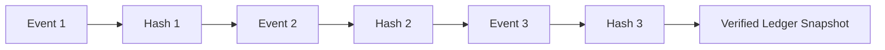

**Sovereignty question:** Can Vorcaro reconstruct exactly who did what, when, from which device, and under which financial state?

**AI boundary:** AI can recommend event classification. It must not forge, alter, or silently suppress event history.

---

## 7. Synchronization Model

## 7.1 Online Operation Flow

When online, every operation should first fetch the latest source-of-truth state.

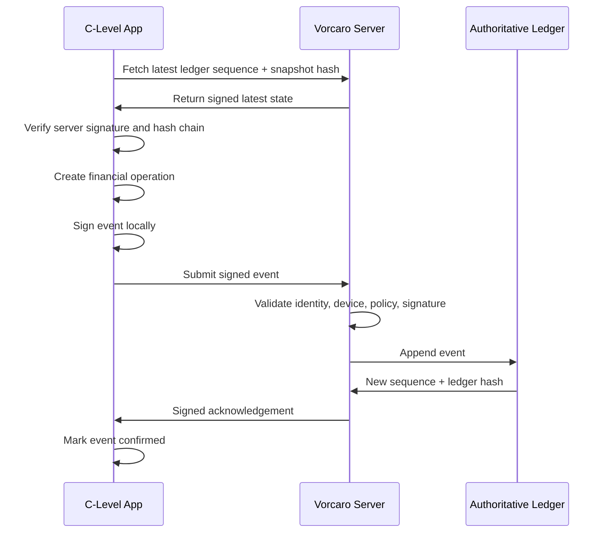

## 7.2 Offline Operation Flow

Offline actions are allowed, but only as pending intentions.

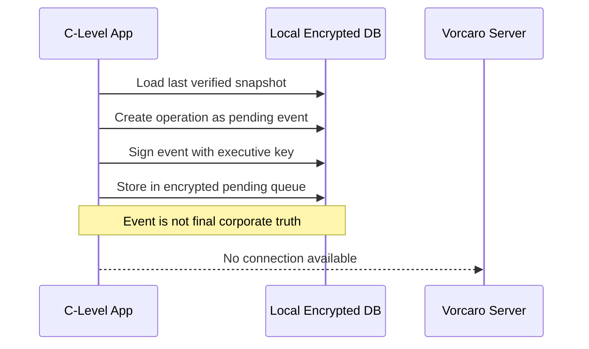

## 7.3 Reconnection Flow

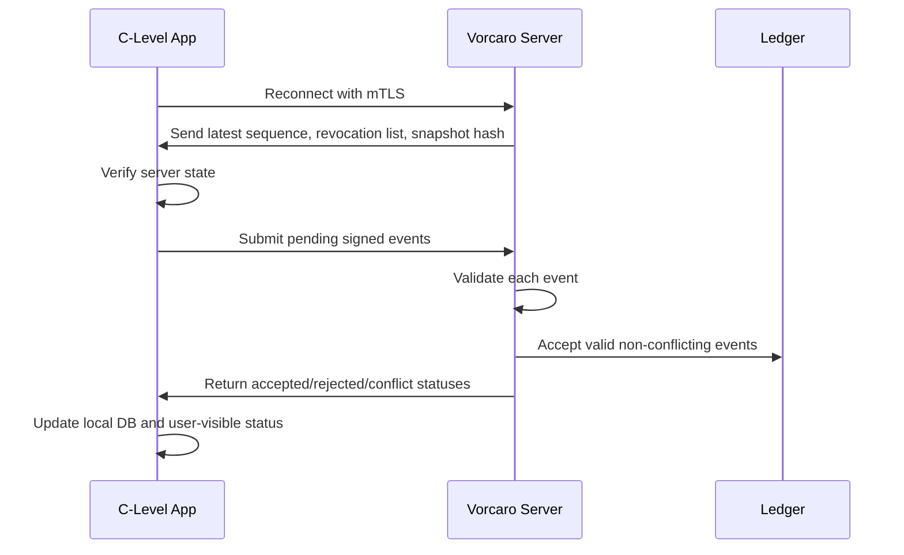

## 7.4 Conflict Handling

Conflicts must be explicit, not silently merged.

### Detection Rule (concrete, not vibes)

A conflict exists when an incoming event's `base_server_sequence` is older than the sequence of the last accepted event touching the same `(object_type, object_id)`. In other words: the client acted on stale state for that object. This is why `base_server_sequence` and the object identifiers are client-signed plaintext — the server must detect conflicts without waiting on payload semantics.

While an object is conflicted:

* The last **accepted** state remains the operative state — a conflict never blanks an object.
* The object is flagged; policy blocks new material actions against it (payments, approvals) until a signed resolution event lands.
* Both conflicting events stay in the ledger permanently with `status: conflicted`. Resolution appends a new event; it never edits history.

Example conflict:

* CFO changes Q4 cash forecast offline.
* CEO changes same forecast online.
* Server accepts both as events.
* Server marks forecast state as conflicted.
* Finance governance resolves.

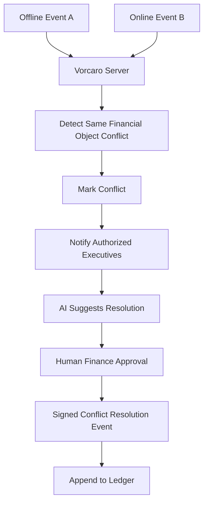

**Sovereignty question:** Do conflicts produce hidden data loss, or visible governance decisions?

**AI boundary:** AI can propose reconciliation. Humans approve the resolution event.

---

## 8. Security Model

The system should follow zero-trust principles: trust is not granted merely because a user or device is inside the corporate network. NIST SP 800-207 defines zero trust architecture and deployment models intended to improve enterprise security posture.

### Minimum Security Requirements

* Mutual TLS between app and server.
* Vorcaro-owned certificate authority.
* Per-device certificates.
* Per-executive signing keys.
* Short-lived sessions.
* Hardware-backed local keys where possible.
* Encrypted local database.
* Signed events.
* Signed server acknowledgements.
* Replay protection.
* Revocation lists.
* Immutable audit logs.
* No external startup dependencies.
* No unauthenticated sync.
* No plaintext financial exports by default.
* No silent background data exfiltration.

### Application Security Verification

Use OWASP ASVS as a security requirements baseline. OWASP describes ASVS as a basis for testing web application technical security controls and as a list of secure development requirements.

Recommended target: **ASVS Level 3 equivalent** for high-value finance/security workflows.

**Sovereignty question:** Can Vorcaro prove security posture through repeatable verification, not executive optimism?

**AI boundary:** AI can run static analysis, dependency review, and policy checks in CI. Humans approve production releases.

---

## 9. Permission and Governance Model

Use a combination of:

* RBAC: role-based access.
* ABAC: attribute-based conditions.
* Policy-as-code.
* Multi-party approval for critical operations.

### Example Roles

* CEO.
* CFO.
* COO.
* Treasurer.
* General Counsel.
* Internal Audit.
* Security Recovery Officer.
* Finance Controller.

### Example Sensitive Operations

Require multi-party approval for:

* Key recovery.
* Device reactivation.
* Payment above threshold.
* Budget override.
* Manual ledger correction.
* Source-of-truth rollback.
* Export of sensitive finance data.
* Policy changes.
* Emergency access.

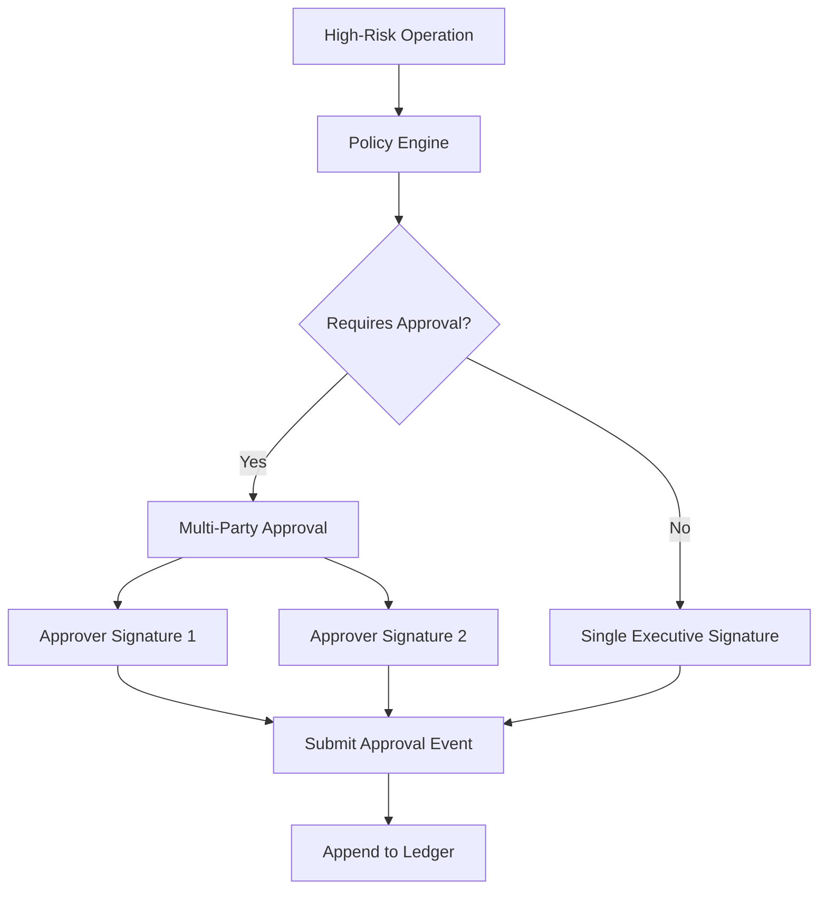

**Sovereignty question:** Which actions are too powerful for one charming executive with a laptop?

**AI boundary:** AI can recommend approvers and detect policy violations. It must not approve on behalf of executives.

---

## 10. AI Agent Capabilities

AI should be useful, local-first, and subordinate to cryptographic truth.

### Permitted AI Functions

* Cash-flow summaries.
* Burn-rate analysis.
* Forecast explanations.
* Anomaly detection.
* Duplicate invoice detection.
* Vendor risk scoring.
* Budget variance explanation.
* Drafting board summaries.
* Reconciliation suggestions.
* Conflict-resolution proposals.
* Audit preparation.
* Natural-language query over local finance data.

### Restricted AI Functions

AI must not:

* Hold private keys.
* Sign events.
* Approve payments.
* Recover access.
* Modify authoritative records.
* Suppress audit logs.
* Export data without human approval.
* Contact external models without explicit Vorcaro policy.

### AI Deployment Model

Preferred:

```text
Local AI model for executive summaries and offline analysis.
Server-side Vorcaro-hosted AI for heavier reconciliation and anomaly detection.
No third-party AI API for sensitive finance data by default.
```

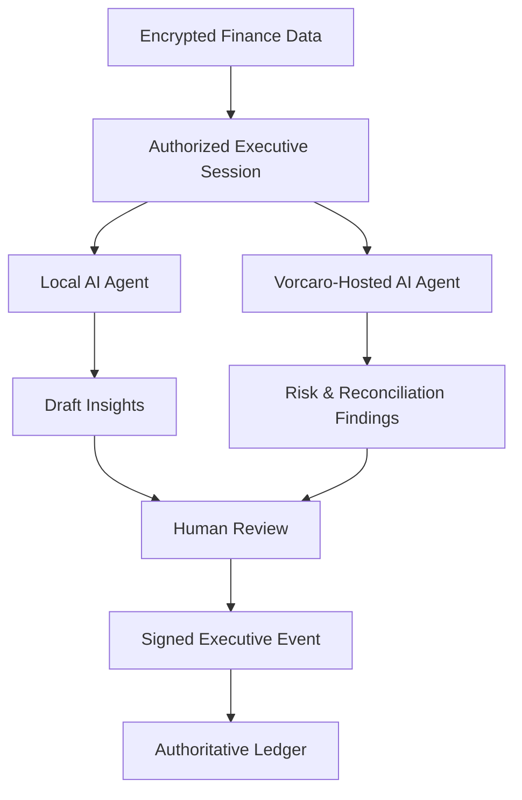

**Sovereignty question:** Does the AI serve Vorcaro’s ledger, or has Vorcaro’s ledger become training material for someone else’s empire?

---

## 11. Data Model Overview

### Core Entities

```text
Executive
Device
Role
Permission
KeyPackage
RecoveryPolicy
FinancialEntity
Account
Vendor
Transaction
Budget
Forecast
Approval
LedgerEvent
LedgerSnapshot
SyncState
AuditLog
Conflict
Attachment
AIInsight
```

### LedgerEvent Table

```text
ledger_events
- id                      (client event_id, ULID — idempotency key)
- server_sequence         (server-assigned, gapless per ledger)
- event_type
- actor_id
- device_id
- device_event_counter    (per-device monotonic, replay protection)
- base_server_sequence    (client-signed; basis for conflict detection)
- object_type
- object_id
- encrypted_payload
- payload_hash            (client-signed)
- previous_ledger_hash    (server-assigned at append)
- resulting_ledger_hash   (server-assigned at append)
- client_signature
- server_signature
- status                  (pending | accepted | rejected | conflicted | quarantined)
- client_timestamp        (recorded, never trusted for policy)
- server_timestamp        (authoritative for policy and audit)
- accepted_at
```

Rejected and quarantined events are **retained in the ledger**, not deleted — a rejected intention is itself audit evidence. `status` transitions are themselves appended as events, never in-place mutations.

### Device Table

```text
devices
- id
- executive_id
- certificate_fingerprint
- public_key
- status
- enrolled_at
- revoked_at
- last_seen_at
- risk_score
```

### Key Package Table

```text
key_packages
- id
- executive_id
- key_version
- wrapped_data_key
- recovery_wrapped_key
- status
- created_at
- revoked_at
```

---

## 12. MVP Scope

The first version should prove the truth model before chasing beautiful executive polish.

### MVP Must Include

* Electron hardened shell.
* Encrypted local database.
* Executive login and local vault unlock.
* Vorcaro server sync.
* Signed events.
* Online operation flow.
* Offline pending event queue.
* Server authoritative ledger.
* Device enrollment.
* Device revocation.
* Key recovery prototype.
* Ledger hash verification.
* Basic dashboard:

  * cash position,
  * accounts,
  * inflows/outflows,
  * pending approvals,
  * sync status,
  * conflicts,
  * audit log.

### MVP Should Exclude

* Public blockchain.
* Third-party AI APIs.
* Complex predictive trading.
* External SaaS integrations.
* Automatic payment execution.
* Uncontrolled exports.
* Remote UI loading.

**Sovereignty question:** Does the MVP prove Vorcaro can operate securely offline and reconcile truth later?

**AI boundary:** MVP AI should be advisory only: summaries, anomalies, reconciliation suggestions.

---

## 13. Suggested Implementation Phases

### Phase 1 — Cryptographic Ledger Prototype

Build:

* Event model.
* Signature validation.
* Local encrypted storage.
* Server append-only ledger.
* Hash chain verification.
* Basic sync.

Success criterion:

```text
Two offline executives can create pending events, reconnect, and converge to the same authoritative server state.
```

---

### Phase 2 — Identity, Device, and Recovery

Build:

* Device certificates.
* Executive enrollment.
* Device revocation.
* Key wrapping.
* Vorcaro-controlled recovery flow.
* Multi-party recovery approval.

Success criterion:

```text
A lost device can be revoked, an executive key can be recovered, and prior data remains accessible without trusting a vendor.
```

---

### Phase 3 — Finance Domain Features

Build:

* Accounts.
* Budgets.
* Forecasts.
* Approvals.
* Reconciliation.
* Cash-flow dashboards.
* Audit views.

Success criterion:

```text
C-level users can operate core finance workflows with verifiable auditability.
```

---

### Phase 4 — AI Assistance

Build:

* Local natural-language finance queries.
* Variance explanations.
* Anomaly detection.
* Conflict-resolution suggestions.
* Board-summary drafting.

Success criterion:

```text
AI reduces analysis workload without owning decisions, keys, approvals, or truth.
```

---

## 14. Final Chairman’s Recommendation

Build this as:

```text
Hardened Electron App
+ Encrypted Local Database
+ Executive Key Hierarchy
+ Signed Offline Intentions
+ Vorcaro-Owned Authoritative Ledger Server
+ Deterministic Sync
+ Human-Governed Recovery
+ Advisory AI Agents
```

Do not let blockchain, dashboards, or AI agents distract from the real product: **Vorcaro Enterprises owning its financial truth under hostile conditions**.

A dashboard tells executives what happened.
This system proves what happened.

That distinction is where empires are protected.
